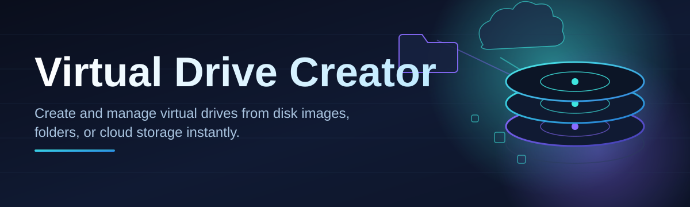

# virtual-drive-creator-utility 💽🗂️

  

*Turn any file, folder, or block of memory into a fully-mountable virtual drive — no drivers, no drama.*

| Requirement | Details |
|---|---|
| **OS** | Windows 10 / Windows 11 (64-bit) |
| **Install** | None — standalone `.exe` |
| **Dependencies** | Zero. Nothing to configure. |

  

---

## 🧭 Overview

**virtual-drive-creator-utility** is a lightweight Windows tool that lets you spin up virtual drives on demand — mounted ISO and IMG images, RAM-backed disks, encrypted virtual volumes, or plain container files that behave exactly like a physical drive letter in Explorer. Think of it as a pocket-sized disk factory: you describe what you want, it hands you a drive letter, and Windows treats the result like any other volume.

We built this because the built-in Windows tooling for virtual disk creation is scattered across Disk Management, PowerShell cmdlets, and half-remembered command flags. If you've ever needed a quick sandbox drive for testing, a fast RAM disk for temp files, or a way to mount a legacy ISO without burning a physical disc, you know the friction. This utility collapses that whole workflow into a single window with sane defaults.

It's aimed at developers who need disposable test volumes, IT folks provisioning demo environments, archivists mounting disk images for inspection, and power users who just want a faster scratch drive. No signup, no background service humming on your machine — it runs when you open it, and gets out of the way when you don't.

> [!TIP]
> Bookmark the landing page above — it always points to the current build, so you never have to hunt for the "right" version.

---

## 💽 What Makes It Tick

  

**Instant drive letters.** Pick a letter, pick a size, click create — your new virtual drive shows up in Explorer before you've let go of the mouse.

**Multi-format mounting.** Mount ISO, IMG, VHD, and VHDX containers directly, without needing a separate burning or archive tool.

**RAM-disk mode.** Carve out a slice of system memory as a blazing-fast scratch volume for builds, renders, or temp caches — gone the moment you unmount it.

**Encrypted virtual volumes.** Wrap sensitive files in a password-protected container that only becomes readable once mounted through the app.

**Dynamic or fixed sizing.** Choose containers that grow as you fill them, or lock in a fixed footprint for predictable disk usage.

**Drive templates.** Save a configuration — size, format, mount point — and re-spawn it later in two clicks instead of re-entering every field.

**Batch mount queue.** Line up several images and mount them together, handy when standing up a test rig with multiple disks.

**Silent auto-unmount.** Set an idle timer so forgotten drives clean themselves up instead of lingering and eating memory.

**Explorer context menu hook.** Right-click any supported image file to mount it directly, skipping the main window entirely.

> [!NOTE]
> All virtual drives created here are session-based by default. Nothing writes to your physical partitions unless you explicitly export a container to disk.

---

## 🚀 Getting Rolling

1. **Visit the landing page** — hit the download button above to reach the project site.

2. **Grab the latest build** — one `.exe`, no installer wizard, no bundled extras.

3. **Run it** — Windows may show a SmartScreen prompt for unsigned apps; click "More info → Run anyway."

4. **Create your first drive** — choose a size, a format, a letter, and press **Create**. That's it.

> [!IMPORTANT]
> Run as Administrator the first time. Mounting virtual volumes requires elevated permissions on most Windows configurations — the app will tell you if it's missing them.

---

## 🖥️ System Requirements

| Category | Minimum | Recommended |
|---|---|---|
| **OS** | Windows 10 (64-bit) | Windows 11 (64-bit) |
| **RAM** | 2 GB free | 8 GB+ for RAM-disk mode |
| **Disk space** | 20 MB for the app | + space for any fixed-size containers |
| **Permissions** | Standard user | Administrator (for mount operations) |
| **Dependencies** | None | None |

> [!WARNING]
> Antivirus suites occasionally flag disk-mounting utilities as suspicious purely because of the low-level APIs involved. This is a standard false positive for tools in this category — check the hash on the landing page if you're unsure.

---

## ⚙️ How It Works

The whole pipeline boils down to five moves: you configure a container, the engine allocates the backing storage, Windows registers a virtual disk device, a drive letter gets bound to it, and your files land on a real, browsable volume.

Under the hood it leans on native Windows virtual disk APIs rather than reinventing disk emulation — that's why there's no driver install and no reboot required after creating or removing a drive.

---

<strong>🔧 Troubleshooting & FAQ</strong>

 

**Q: My drive letter disappeared after sleep/hibernate.**
A: RAM-disk volumes don't survive a full power cycle by design — recreate it from a saved template in seconds.

**Q: Mounting an ISO fails with an "access denied" message.**
A: Relaunch the utility as Administrator; ISO mounting touches the Virtual Disk service which needs elevation.

**Q: Can I mount the same image on two different letters at once?**
A: Yes — duplicate the mount entry in the queue and assign a second free letter before confirming.

**Q: The app says the container is "in use" but I already unmounted it.**
A: Another process may still hold a file handle open (Explorer preview pane is a common culprit). Close it and retry.

**Q: Encrypted volumes prompt for a password every single time — can I skip that?**
A: That prompt is intentional; it's the only thing standing between your data and anyone with physical access to the machine.

**Q: My antivirus quarantined the executable.**
A: Restore it from quarantine and verify the download came from the official landing page linked in this README.

---

<strong>🎨 UI & UX Details</strong>

 

**Themes.** Light and dark modes ship out of the box, following your system theme by default.

**Keyboard shortcuts:**

| Shortcut | Action |
|---|---|
| `Ctrl + N` | Create new virtual drive